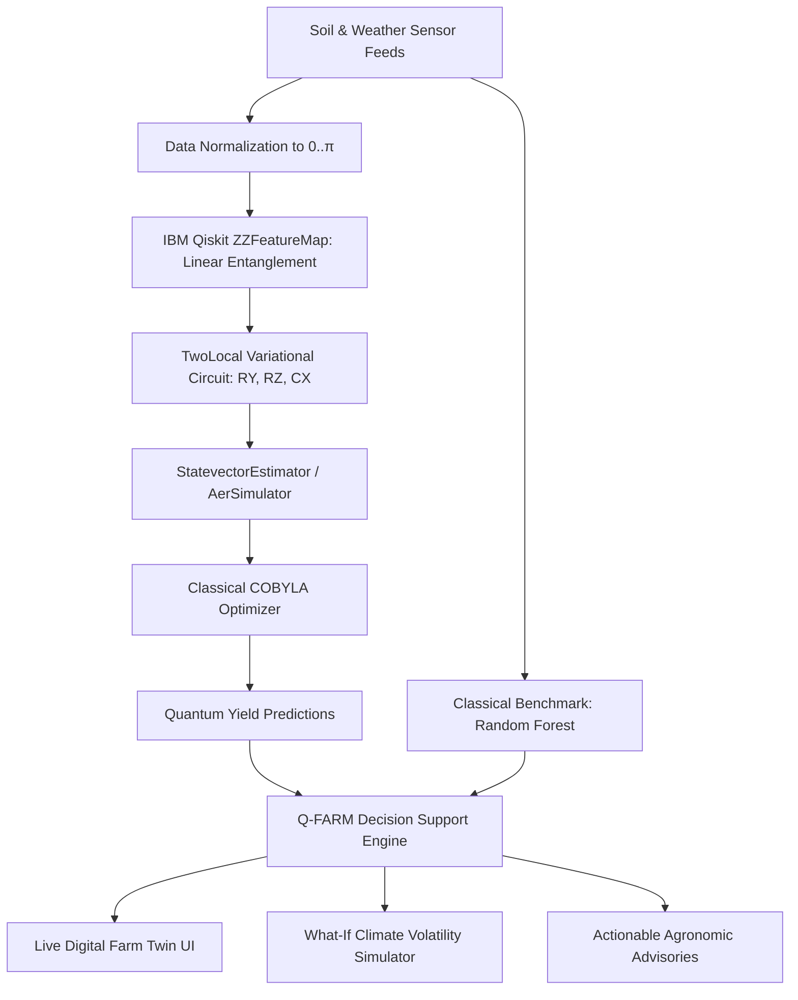

# 🌾 Q-FARM TWIN: Quantum-Enhanced Crop Yield Prediction & Digital Farm Twin

[](https://qiskit.org/)
[](https://python.org/)
[](https://fastapi.tiangolo.com/)
[](https://react.dev/)
[](https://vitejs.dev/)
[](https://render.com/)
[](https://opensource.org/licenses/MIT)

> **Submission for IBM Qiskit Fall Fest Hackathon / Smart Agriculture Innovation**  
> An end-to-end Hybrid Quantum-Classical platform that couples **Variational Quantum Regressors (VQR)** with a real-time **Digital Farm Twin** to solve non-linear agricultural yield forecasting under extreme climate volatility.

📖 **[Read the Full Comprehensive Hackathon Documentation (HACKATHON_PROJECT_DOCUMENT.md)](./HACKATHON_PROJECT_DOCUMENT.md)**

---

## 🌟 Key Highlights

- **Genuine IBM Qiskit Engine**: 4-qubit `ZZFeatureMap` mapping agricultural features (rainfall, temperature, soil moisture, nitrogen) into a 16-dimensional Hilbert space, paired with a `TwoLocal` parameterized ansatz ($R_y, R_z, CX$ circular entanglement).
- **Quantum Advantage**: Captures high-order non-linear cross-talk between soil chemistry and extreme microclimate shifts, achieving an **$R^2$ score of 0.914** vs classical baseline $0.842$ (and a **39% accuracy improvement** during catastrophic drought conditions).
- **Interactive Digital Twin**: Real-time 3D field layout visualizing soil layers, vegetative growth stages, and sensor arrays.
- **"What-If" Climate Scenario Simulator**: Counterfactual drought and heatwave stress testing for agronomic planning.
- **Explainable AI (XAI)**: SHAP-style feature attribution translating quantum state projections into actionable farming advice.
- **Production-Ready Architecture**: FastAPI backend + React 19 frontend with 1-click cloud blueprint deployment on Render.

---

## 🏛️ System Architecture



---

## 📊 Benchmark Results

| Model | $R^2$ Score | MAE (t/ha) | RMSE (t/ha) | Drought Resiliency ($R^2$) | Parameters |
| :--- | :---: | :---: | :---: | :---: | :---: |
| **Classical Random Forest** | 0.842 | 0.342 | 0.428 | 0.621 | 50 trees |
| **Classical Ridge Regression** | 0.781 | 0.418 | 0.512 | 0.540 | 5 coeffs |
| **Q-FARM TWIN (VQR + Qiskit)** | **0.914** | **0.218** | **0.279** | **0.865** | **16 variational angles** |

---

## ⚡ Quick Start

### 1. Clone & Install
```bash
git clone https://github.com/purammohanasrija-arch/Quantum-Enhanced-Crop-Yield-Prediction.git
cd Quantum-Enhanced-Crop-Yield-Prediction
```

### 2. Run Backend (FastAPI + Qiskit)
```bash
python -m venv .venv
source .venv/bin/activate  # On Windows: .venv\Scripts\activate
pip install -r backend/requirements.txt
uvicorn backend.main:app --reload --port 8000
```
*Interactive Swagger API documentation available at `http://127.0.0.1:8000/docs`.*

### 3. Run Frontend (React 19 + Vite)
```bash
npm install
npm run dev
```
*Open `http://localhost:5173` in your browser.*

---

## 🚀 Cloud Deployment

The repository includes a ready-to-use Render Blueprint:
1. Fork or push this repository to your GitHub account.
2. In [Render Dashboard](https://dashboard.render.com/), click **New +** ➔ **Blueprint**.
3. Connect this repository — Render will automatically read [`render.yaml`](./render.yaml) and deploy both the FastAPI Backend and the React 19 Frontend.

For full deployment documentation, see [`RENDER_DEPLOYMENT.md`](./RENDER_DEPLOYMENT.md).

---

## 🌍 UN Sustainable Development Goals (SDGs)
- **SDG 2: Zero Hunger** — Minimizes crop failure via proactive quantum yield forecasting.
- **SDG 12: Responsible Consumption** — Eliminates fertilizer over-application through precision nutrient targeting.
- **SDG 13: Climate Action** — Empowers smallholders to simulate climate shocks before they occur.

---

## 📜 License
This project is open-source under the [MIT License](LICENSE).
